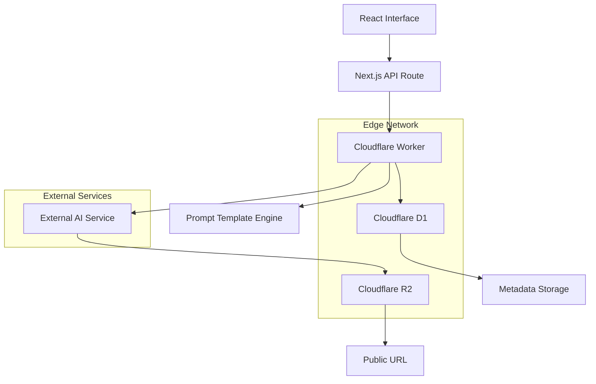

# Design Document

## Overview

O Motor de Geração de Imagens do Capitão Caverna é um sistema edge-first que implementa geração programática de imagens baseada na matriz de prompts estruturada existente. O sistema integra-se nativamente com a arquitetura Cloudflare (Workers, D1, R2) para fornecer geração sob demanda de imagens do mascote com latência mínima e alta consistência visual.

O design segue o fluxo de trabalho de ponta a ponta especificado no PRD v2.0: Interface → API → Geração Externa → R2 → D1 → Resposta, aproveitando a co-localização na rede de borda para performance otimizada.

## Architecture

### High-Level Architecture



### Component Integration Flow

1. **Frontend Selection**: Usuário seleciona parâmetros (pose, traje, calçado, adereços)
2. **API Processing**: Worker valida entrada e constrói prompt usando template engine
3. **External Generation**: Chamada para serviço de IA (Midjourney/DALL-E/Stable Diffusion)
4. **Asset Storage**: Worker faz fetch da imagem e armazena no R2 com chave UUID
5. **Metadata Persistence**: Registro no D1 com parâmetros, status e referências
6. **Response Delivery**: URL pública retornada para o cliente

## Components and Interfaces

### 1. Prompt Template Engine

**Responsabilidade**: Construção programática de prompts baseada na matriz estruturada

**Interface**:
```typescript
interface PromptTemplateEngine {
  buildPrompt(params: ImageGenerationParams): string;
  validateParameters(params: ImageGenerationParams): ValidationResult;
  getAvailableOptions(): PromptOptions;
}

interface ImageGenerationParams {
  pose: string;
  outfit: string;
  footwear: string;
  prop?: string;
  frameType?: 'standard' | 'onboarding' | 'sequence';
  frameId?: string; // Para frames específicos como "01A", "02B", etc.
}

interface PromptOptions {
  poses: string[];
  outfits: string[];
  footwear: string[];
  props: string[];
  frames: FrameDefinition[];
}
```

**Implementação**:
- Template base com especificações técnicas fixas (STANDARD CAVE ENVIRONMENT FOUNDATION, CHARACTER FOUNDATION)
- Sistema de injeção de variáveis para elementos específicos
- Validação de compatibilidade entre parâmetros
- Suporte para frames narrativos específicos com posicionamento detalhado

### 2. Image Generation Service Adapter

**Responsabilidade**: Abstração para diferentes serviços de geração de IA

**Interface**:
```typescript
interface ImageGenerationService {
  generateImage(prompt: string): Promise<GenerationResult>;
  getServiceStatus(): Promise<ServiceStatus>;
}

interface GenerationResult {
  success: boolean;
  imageUrl?: string;
  error?: string;
  retryAfter?: number;
}
```

**Implementação**:
- Adapter pattern para suportar múltiplos serviços (Midjourney, DALL-E, Stable Diffusion)
- Retry logic com backoff exponencial
- Rate limiting e circuit breaker patterns
- Timeout handling e error categorization

### 3. Asset Storage Manager

**Responsabilidade**: Gerenciamento de armazenamento no Cloudflare R2

**Interface**:
```typescript
interface AssetStorageManager {
  storeImage(imageData: Blob, metadata: ImageMetadata): Promise<StorageResult>;
  generatePublicUrl(objectKey: string): string;
  deleteImage(objectKey: string): Promise<boolean>;
}

interface StorageResult {
  success: boolean;
  objectKey: string;
  publicUrl: string;
  error?: string;
}
```

**Implementação**:
- UUID-based object keys para evitar colisões
- Otimização para zero egress fees do R2
- Metadata embedding para facilitar descoberta
- Cleanup policies para gerenciamento de espaço

### 4. Database Layer (D1 Integration)

**Responsabilidade**: Persistência de metadados e auditoria

**Interface**:
```typescript
interface DatabaseLayer {
  insertGeneratedImage(record: GeneratedImageRecord): Promise<string>;
  updateImageStatus(imageId: string, status: ImageStatus): Promise<boolean>;
  getUserImages(userId: string, limit?: number): Promise<GeneratedImageRecord[]>;
  getImageByParameters(params: ImageGenerationParams): Promise<GeneratedImageRecord | null>;
}

interface GeneratedImageRecord {
  image_id: string;
  user_id: string;
  r2_object_key: string;
  prompt_parameters: string; // JSON serialized
  created_at: string;
  status: 'PENDING' | 'COMPLETE' | 'FAILED';
  error_message?: string;
}
```

## Data Models

### Database Schema (Cloudflare D1)

```sql
-- Tabela principal para imagens geradas
CREATE TABLE GeneratedImages (
    image_id TEXT PRIMARY KEY,
    user_id TEXT NOT NULL,
    r2_object_key TEXT NOT NULL,
    prompt_parameters TEXT NOT NULL, -- JSON com pose, outfit, footwear, prop, frameId
    created_at TIMESTAMP DEFAULT CURRENT_TIMESTAMP,
    status TEXT NOT NULL CHECK (status IN ('PENDING', 'COMPLETE', 'FAILED')),
    error_message TEXT,
    generation_time_ms INTEGER,
    service_used TEXT, -- 'midjourney', 'dalle', 'stable-diffusion'
    
    FOREIGN KEY (user_id) REFERENCES Users(user_id)
);

-- Índices para performance
CREATE INDEX idx_generated_images_user_id ON GeneratedImages(user_id);
CREATE INDEX idx_generated_images_status ON GeneratedImages(status);
CREATE INDEX idx_generated_images_created_at ON GeneratedImages(created_at);

-- Tabela para cache de prompts (otimização)
CREATE TABLE PromptCache (
    parameters_hash TEXT PRIMARY KEY,
    full_prompt TEXT NOT NULL,
    created_at TIMESTAMP DEFAULT CURRENT_TIMESTAMP
);
```

### Prompt Template Structure

```typescript
interface PromptTemplate {
  foundation: {
    environment: string; // STANDARD CAVE ENVIRONMENT FOUNDATION
    character: string;   // CAPITÃO CAVERNA — CHARACTER FOUNDATION
    technical: string;   // TEXTURE / RESOLUTION BOOST
    brand: string;       // BRAND ACCURACY — LOGO & COLORS
    safeguards: string;  // BODY SAFEGUARDS + NEGATIVE PROMPTS
  };
  
  variables: {
    pose: PoseDefinition;
    outfit: OutfitDefinition;
    footwear: FootwearDefinition;
    prop?: PropDefinition;
  };
  
  frame?: FrameDefinition;
}

interface FrameDefinition {
  id: string; // "01A", "02B", etc.
  location: string;
  positioning: string;
  limbMetrics: string;
  poseSpecifics: string;
  facialExpression: string;
  lighting: string;
  camera: string;
  environmentalTouches: string;
  voiceover?: string;
}
```

## Error Handling

### Error Categories and Responses

1. **Validation Errors (400)**
   - Invalid parameter combinations
   - Missing required fields
   - Unsupported pose/outfit combinations

2. **Authentication Errors (401)**
   - Invalid or missing user authentication
   - Insufficient permissions

3. **Rate Limiting (429)**
   - User exceeded generation quota
   - Service rate limits reached

4. **External Service Errors (502/503)**
   - AI service unavailable
   - Generation timeout
   - Service-specific errors

5. **Storage Errors (500)**
   - R2 upload failures
   - D1 database errors
   - Insufficient storage quota

### Retry Strategy

```typescript
interface RetryConfig {
  maxAttempts: 3;
  baseDelay: 1000; // ms
  maxDelay: 10000; // ms
  backoffMultiplier: 2;
  retryableErrors: ['TIMEOUT', 'SERVICE_UNAVAILABLE', 'RATE_LIMITED'];
}
```

### Circuit Breaker Implementation

- **Failure Threshold**: 5 consecutive failures
- **Recovery Timeout**: 30 seconds
- **Half-Open State**: Single test request before full recovery

## Testing Strategy

### Unit Tests

1. **Prompt Template Engine**
   - Parameter validation
   - Template construction accuracy
   - Frame-specific prompt generation
   - Negative prompt inclusion

2. **Service Adapters**
   - Mock external service responses
   - Error handling scenarios
   - Retry logic validation

3. **Database Layer**
   - CRUD operations
   - Query performance
   - Transaction handling

### Integration Tests

1. **End-to-End Flow**
   - Complete generation workflow
   - Error propagation
   - Status updates

2. **External Service Integration**
   - Real API calls (limited)
   - Service-specific error handling
   - Response parsing

### Performance Tests

1. **Load Testing**
   - Concurrent generation requests
   - Database performance under load
   - R2 upload throughput

2. **Latency Testing**
   - Edge network performance
   - D1 query response times
   - R2 access latency

### Visual Consistency Tests

1. **Prompt Accuracy**
   - Generated images match specifications
   - Brand consistency validation
   - Character proportion verification

2. **Frame Sequence Testing**
   - Narrative continuity
   - Lighting consistency
   - Environmental coherence

## Security Considerations

### Authentication and Authorization

- JWT-based user authentication
- Role-based access control for admin features
- Rate limiting per user/IP

### Data Protection

- Prompt parameters sanitization
- SQL injection prevention (prepared statements)
- XSS protection in API responses

### Resource Protection

- Generation quota enforcement
- Storage limits per user
- API rate limiting

### Content Safety

- Prompt content filtering
- Generated image moderation hooks
- Abuse detection and prevention

## Performance Optimizations

### Caching Strategy

1. **Prompt Cache**: Cache constructed prompts by parameter hash
2. **CDN Integration**: R2 images served through Cloudflare CDN
3. **Database Query Optimization**: Indexed queries for common patterns

### Edge Computing Benefits

1. **Co-location**: Worker, D1, and R2 in same edge location
2. **Reduced Latency**: Minimal network hops
3. **Global Distribution**: Consistent performance worldwide

### Resource Management

1. **Connection Pooling**: Efficient D1 connections
2. **Batch Operations**: Bulk database operations where possible
3. **Lazy Loading**: On-demand resource initialization

## Monitoring and Observability

### Metrics Collection

- Generation success/failure rates
- Average generation time
- Storage utilization
- User engagement patterns

### Logging Strategy

- Structured logging with correlation IDs
- Error tracking and alerting
- Performance monitoring

### Health Checks

- Service availability monitoring
- Database connectivity checks
- External service status tracking